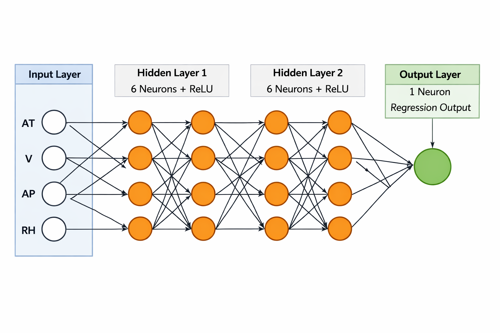
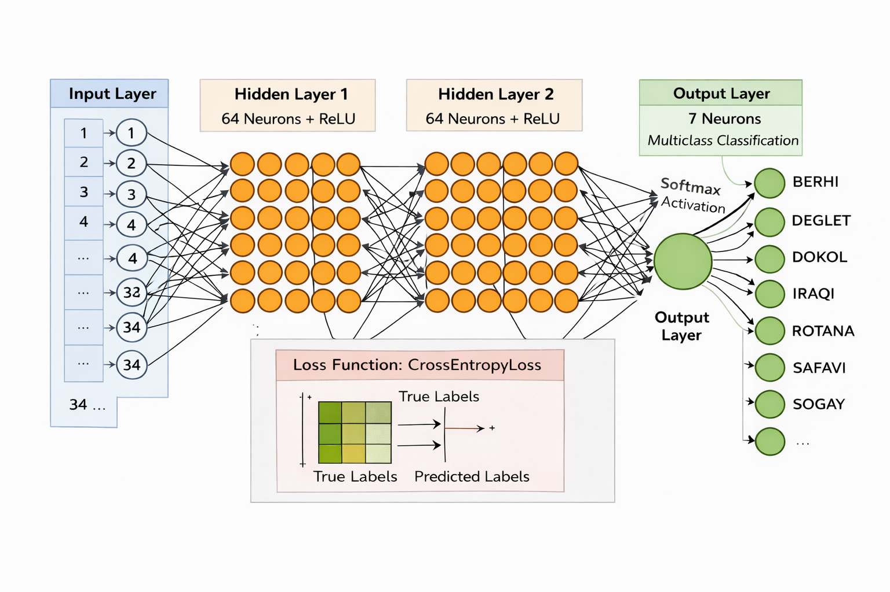

# ANN Projects using PyTorch

This repository contains two Artificial Neural Network (ANN) implementations:

1. 🔌 **Power Plant Energy Prediction (Regression)**
2. 🌴 **Date Fruit Classification (Multiclass Classification)**

---

# 1. Power Plant Energy Prediction (Regression)

## 📊 Dataset

Features:

* AT → Ambient Temperature
* V → Exhaust Vacuum
* AP → Ambient Pressure
* RH → Relative Humidity

Target:

* PE → Electrical Energy Output

---

## ⚙️ Workflow

1. **Data Loading & Exploration** - Dataset is loaded using pandas and basic checks are performed to understand structure and detect missing values. Helps ensure data quality before feeding into the model.
2. **Train-Test Split** - Dataset is divided into training (80%) and testing (20%) sets. This allows evaluation of model performance on unseen data.
3. **Feature Scaling** - Features are standardized using StandardScaler. Ensures all inputs are on the same scale, improving model convergence.
4. **Tensor Conversion** - Data is converted from NumPy arrays to PyTorch tensors. Required because PyTorch models operate on tensor data.
5. **DataLoader Creation**
Data is wrapped into TensorDataset and loaded using DataLoader.
Enables efficient mini-batch training and shuffling of data.

---

## ANN Architecture

* Input: 4 neurons
* Hidden Layer 1: 6 neurons + ReLU
* Hidden Layer 2: 6 neurons + ReLU
* Output: 1 neuron

---

## Architecture Diagram

---

## Training Details

* Loss Function: **MSELoss**
* Optimizer: Adam
* Epochs: 100
* Batch Size: 32

---

## Training Process

1. **Forward Pass** - Input data is passed through the neural network to generate predictions. This step computes outputs based on current weights.
2. **Loss Computation** - The difference between predicted and actual values is measured using MSE. Provides a signal of how well the model is performing.
3. **Backpropagation** - Gradients of the loss are computed with respect to model parameters. This helps determine how weights should be updated.
4. **Optimization Step** - Optimizer (Adam) updates weights using computed gradients. Gradually reduces the loss over epochs.
5. **Gradient Reset** - Gradients are cleared using zero_grad() to prevent accumulation. Necessary for correct gradient computation in the next iteration.
6. **Validation** - Model is evaluated on test data after each epoch. Helps monitor overfitting and generalization.

---

## Evaluation

* Mean Squared Error (MSE)
* R² Score
* Loss curve visualization

---

# 2. Date Fruit Classification (ANN Classification)

## 📊 Dataset

* Total Samples: **898**
* Features: **34 numerical features**
* Classes (7):

  * BERHI
  * DEGLET
  * DOKOL
  * IRAQI
  * ROTANA
  * SAFAVI
  * SOGAY

---

## ⚙️ Preprocessing

* Label Encoding (convert string labels → integers)
* Train-test split
* Feature scaling using StandardScaler
* Conversion to PyTorch tensors

---

## ANN Architecture

* Input Layer: **34 neurons**
* Hidden Layer 1: **64 neurons + ReLU**
* Hidden Layer 2: **64 neurons + ReLU**
* Output Layer: **7 neurons (Softmax internally via CrossEntropyLoss)**

---

## Architecture Diagram

---

## Training Details

* Loss Function: **CrossEntropyLoss**
* Optimizer: Adam
* Epochs: 100
* Batch Size: 32

---

## Training Process

For each epoch:

1. Forward pass → compute predictions
2. Loss calculation using CrossEntropy
3. Backpropagation (`loss.backward()`)
4. Optimizer step (`optimizer.step()`)
5. Zero gradients (`optimizer.zero_grad()`)
6. Validation on test set

---

## Evaluation

### Classification Metrics:

* Accuracy
* Loss curves

---

## Key Differences (Regression vs Classification)

| Component     | Regression | Classification     |
| ------------- | ---------- | ------------------ |
| Output Layer  | 1 neuron   | 7 neurons          |
| Loss Function | MSELoss    | CrossEntropyLoss   |
| Target Type   | Continuous | Categorical        |
| Activation    | Linear     | Softmax (implicit) |

---

## 💾 Model Saving

* Best models saved using PyTorch `state_dict`

---

## Tech Stack

* Python
* PyTorch
* Scikit-learn
* Pandas
* Matplotlib

---
